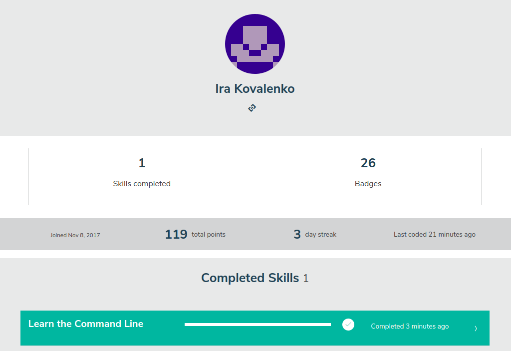

# kottans-frontend
Hi there! Here is my impressions about learned materials. I guess the structure of 'How to use Git and GitHub' lessons is great, they teatch to perfome the basic and crucial operations, but a representation is a bit naive. Git skills could be used not only for programming purposes, and a 'Learngitbranching' tutorial is the greates visualization I've seen, it's deffinitly may help you to refresh your knowlege once it's needed.

## Linux CLI, and HTTP

*what was new to you:*
- 'source ~/.bashrc' . or 'source ~/.bash_profile'
- bash conditions and loops
- read variable
- less almost like cat

*what surprised you:*
- 'mv filename.txt othername.xtx' - renames instead of moving
- Arithmetic relational operators != String comparison operators
- 'echo' for text, 'cat' for files
- 'grep' can be used over directive
- you can pass arguments after script call

*what you intend to use in future:*
- aliases, especially for often used git commands
- bash scripts
