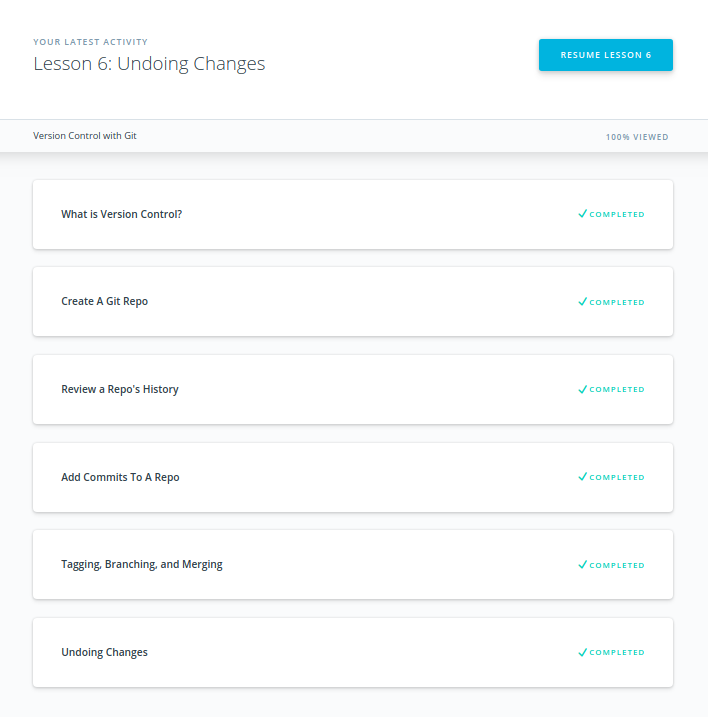
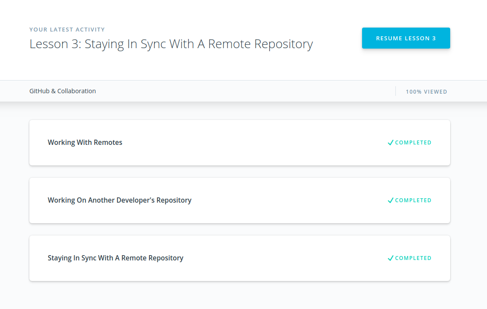
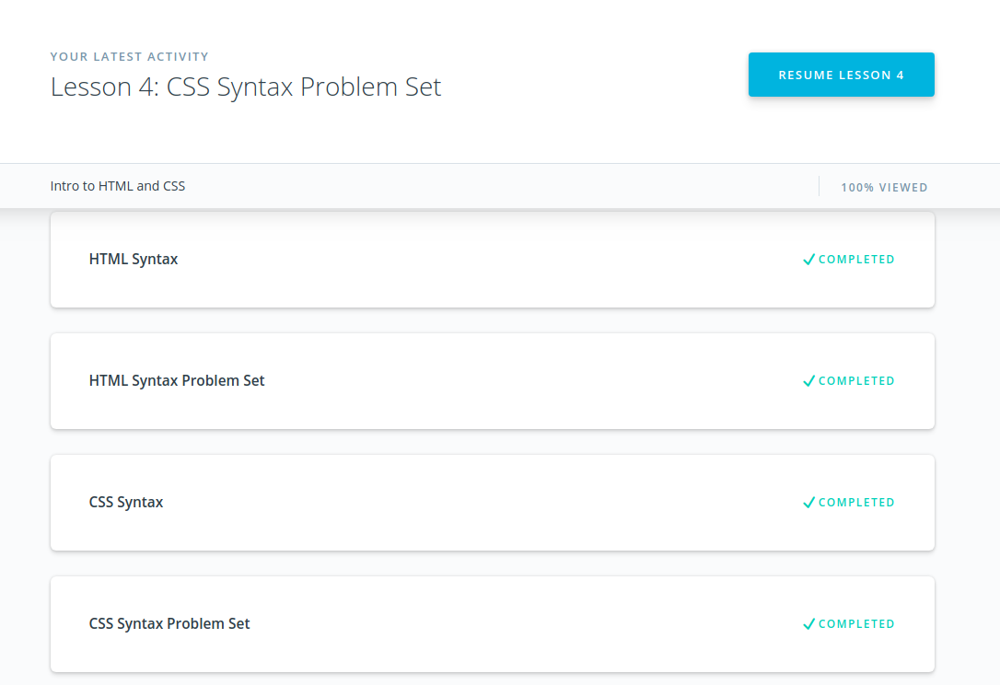
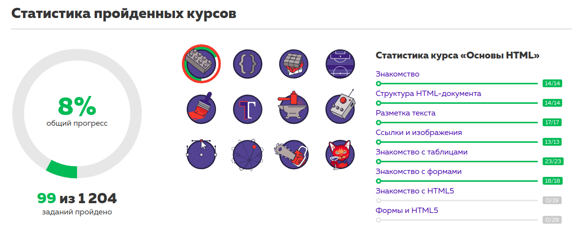
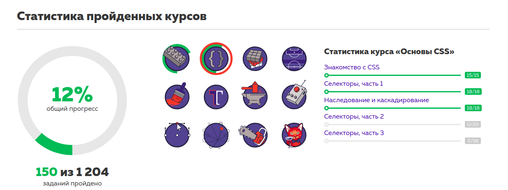
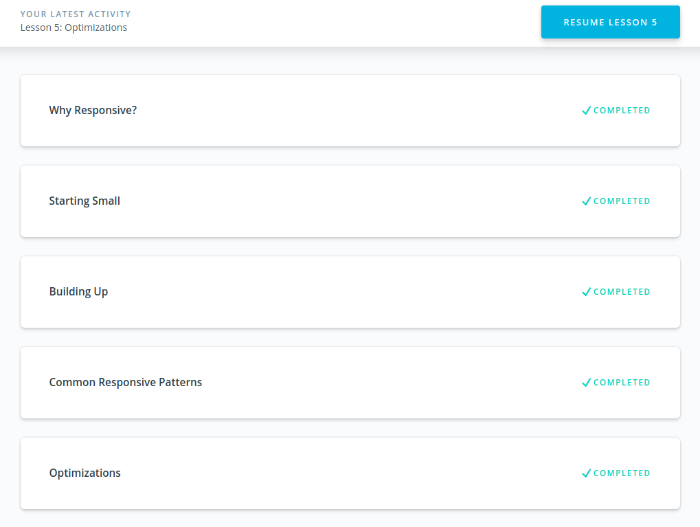
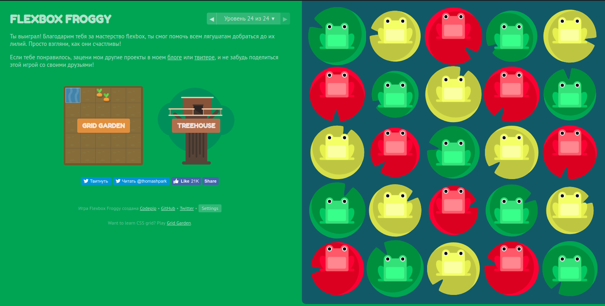

# kottans-frontend
Hi there! Here is my impressions about learned materials. I guess the structure of 'How to use Git and GitHub' lessons is great, they teatch to perfome the basic and crucial operations, but a representation is a bit naive. Git skills could be used not only for programming purposes, and a 'Learngitbranching' tutorial is the greates visualization I've seen, it's deffinitly may help you to refresh your knowlege once it's needed.

## Linux CLI, and HTTP

*what was new to you:*
- 'source ~/.bashrc' . or 'source ~/.bash_profile'
- bash conditions and loops
- read variable
- less almost like cat

*what surprised you:*
- 'mv filename.txt othername.xtx' - renames instead of moving
- Arithmetic relational operators != String comparison operators
- 'echo' for text, 'cat' for files
- 'grep' can be used over directive
- you can pass arguments after script call

*what you intend to use in future:*
- aliases, especially for often used git commands
- bash scripts

## Git Collaboration

*what was new to you*
- 'git log -w'

*what surprised you*
- 'git commit -a' != 'git commit --ammend'

*what you intend to use in future*
- git rebase -i

## Intro to HTML and CSS

*what was new to you*
- figure, figcaption
- del, ins and theirs attribute 'datetime'
- mark
- table caption has property 'caption-side: bottom/top'
- select has attribute 'multiple' and to choose several options you should click with ctrl
- input type="hidden"
- if there will be input type="file", the outer form should have  an attribute 'enctype="multipart/form-data"'

*what surprised you*
- if option of select has no attribute 'value', then a writing inside the tag will be sent instead

*what you're not intend to use in future*
- 'important!'

## Responsive Web Design

*what was new to you*
- 'flex-wrap: wrap-reverse;'
- about 45-90 characters per line
- 'Authors should avoid using percentages in paddings or margins on flex items entirely' — the flexbox spec.
- the margins of adjacent flex items do not ever collapse onto each other

*what surprised you*
- media query could be set as an attribute to a link for css file tag!
- you can but you'd better not to provide media queries in an @import (for sake of performance)
- 'content: attr(data-something);'

*what you intend to use in future*
- 'flex-flow'
- If I want an item to squish in a bit if there isn’t enough room, but not to stretch any wider than it needs to: flex: 0 1 auto
- If my flex item should stretch to fill the available space and squish in a bit if there's not enough room: flex: 1 1 auto
- If my item should not flex at all: flex: 0 0 auto
